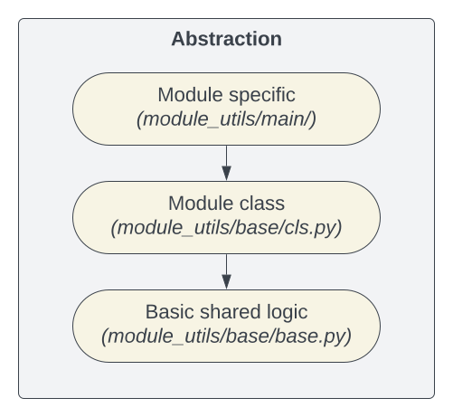
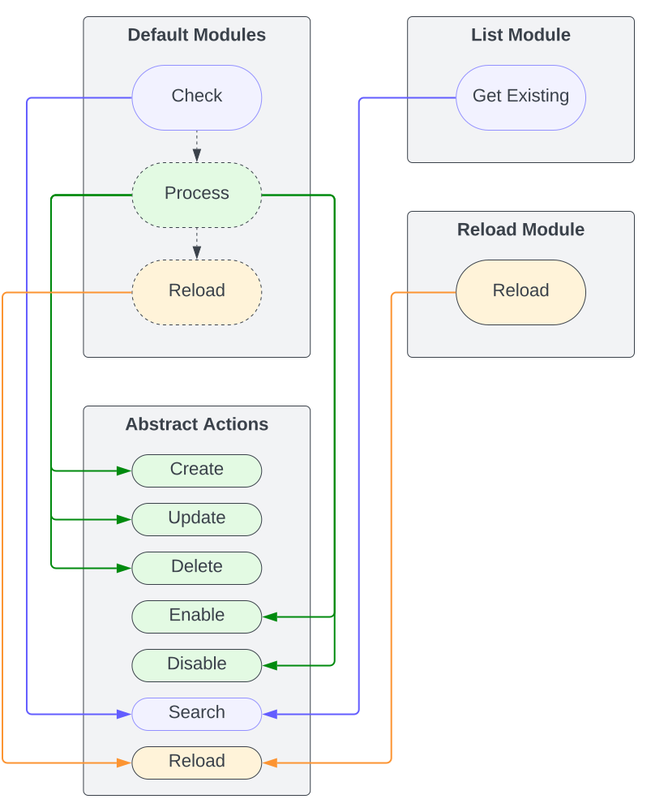

.. _usage_develop:

.. include:: ../_include/head.rst

===========
4 - Develop
===========

The basic API interaction is handled in :code:`oxlorg.opnsense.plugins.module_utils.base.api`.

It is a generic abstraction layer for interacting with the api - therefore all plugins should be able to function with it!

Install
#######

You can install the collection to a specific directory for easier testing.

.. code-block:: bash

    cd $PLAYBOOK_DIR
    ansible-galaxy collection install git+https://github.com/O-X-L/ansible-opnsense.git,<RELEASE/BRANCH/COMMIT> -p ./collections

Of course you can always place the repository at :code:`${PLAYBOOK_DIR}/collections/ansible_collections/oxlorg/opnsense` so it gets picked-up by Ansible.

----

API Definition
##############

To get to know the API - you will have to read into the API's XML-config that is linked in `the OPNsense docs <https://docs.opnsense.org/development/api.html#introduction>`_.

Per example: `Alias.xml <https://github.com/opnsense/core/blob/master/src/opnsense/mvc/app/models/OPNsense/Firewall/Alias.xml>`_

As XML isn't the most readable format - I would recommend translating it to YAML or JSON.

Here is a nice online-tool to do so: `XML-to-YAML <https://codebeautify.org/xml-to-yaml>`_ | `XML-to-JSON <https://codebeautify.org/xml-to-json>`_

Note: There is `a current/old and new API-handling <https://github.com/O-X-L/ansible-opnsense/issues/51>`_.

----

Abstraction
###########

* **Module Abstraction**

  |img_module_abstraction|

* **Module Action-Abstraction**

  |img_module_abstraction_actions|

----

Abstraction Features
********************

The `base class <https://github.com/O-X-L/ansible-opnsense/blob/latest/plugins/module_utils/base/base.py>`_ handles most of the logic.

Single modules, `placed in the main directory <https://github.com/O-X-L/ansible-opnsense/blob/latest/plugins/module_utils/main/>`_ can utilize class-attributes to configure this logic.

Here we list these config-attributes and describe their functionalities:

Required
========

There are some required attributes:

* :code:`API_KEY_PATH`

  OPNsense puts the actual API-data inside a nested-dict.

  This attribute is used to dynamically extract the data we need.

  Example - we want to handle the syslog-destinations:

  .. code-block:: python3

      # API response:
      # {
      #   "syslog": {
      #     "general": {...},
      #     "destinations": {
      #       "destination": [...]
      #     }
      #   }
      # }

      API_KEY_PATH: 'syslog.destinations.destination'

  You can see the raw API-data when adding :ref:`the debug module-argument <usage_develop_debug>`.

* :code:`FIELDS_TYPING`

  Type-casting for values of fields.

  This also handles the extraction of selected values from a :code:`select` list.

  .. code-block:: python3

      FIELDS_TYPING = {
          'int': ['id'],
          'bool': ['enabled'],

          # select with multiple-choice
          'list': ['as_path_list', 'prefix_list', 'community_list'],

          # select with multiple-choice but get the 'pretty-value'
          'list_value': ['member'],

          # select with single-choice
          'select': ['action'],

          # only for edge-cases
          ## handle selection not in dict-format (php array handling)
          'select_opt_list': [],

          ## get index of selected entry
          'select_opt_list_idx': [],
      }

* :code:`API_MOD`

  The OPNsense API-Module to call.

* :code:`API_CONT`

  The OPNsense API-Controller to call.

* :code:`FIELDS_ALL`

  Fields that are parsed from API-responses and added to outbound API-calls.

  If the API-response has fields/values inside a nested-dict - you need to add them as tuple to :code:`FIELDS_TRANSLATE`

* :code:`FIELDS_CHANGE`

  The fields that should be checked for changes.

  They will appear in the :code:`diff` if not specifically excluded via :code:`FIELDS_DIFF_EXCLUDE`

* :code:`CMDS`

  This attribute configures the OPNsense API-commands we need to execute.

  Note: There is `a current/old and new API-handling <https://github.com/O-X-L/ansible-opnsense/issues/51>`_.

  .. code-block:: python3

      # default module
      CMDS = {
          'add': 'addRecord',  # add entry
          'set': 'setRecord',  # modify entry
          'del': 'delRecord',  # delete entry
          'search': 'get',  # get list of all existing entries
          'toggle': 'toggleRecord',  # only en- or disable entry
      }

      # default module with new API-search (more API-calls needed)
      CMDS = {
          'add': 'addReservation',
          'set': 'setReservation',
          'del': 'delReservation',
          'search': 'searchReservation',  # get minimal list of all existing entries
          'detail': 'getReservation',  # get details of a single entry
      }

      # general module
      CMDS = {
          'search': 'get',  # read
          'set': 'set',  # write
      }

* :code:`FIELD_ID`

  If the ansible-module has no :code:`match_fields` defined, we are matching a single field to relate the current entry to an existing one.

  By convention this may be the :code:`name` field.

Optional
========

* :code:`API_CONT_REL`

  Call a different API-controller to reload.

  Often this needs to be the :code:`service` controller.

* :code:`API_CMD_REL`

  Call a specific API-command to reload. Default: :code:`reconfigure`

* :code:`FIELDS_TRANSLATE`

  Translate ansible-module fields to API-fields.

  Ansible-fields should be written in :code:`snake_case` while the API uses a random mix of snake_case, CamelCase, PascalCase, all-lowercase, ... :'(

  When referencing fields by other config-attributes, we always reference the ansible-field-naming!

  Example:

  .. code-block:: python3

      FIELDS_TRANSLATE = {
          # ansible-field <=> api-field
          'errors': 'error_pages',
          'icp_port': 'icpPort',
          'connect_timeout': 'connecttimeout',
      }

  If the API-fields have additional hierarchical depth, they can be translated by providing a tuple as the api-field.

  .. code-block:: python3

      FIELDS_TRANSLATE = {
          # ansible-field <=> api-field
          'log_target': ('logging', 'target'),
      }

* :code:`TIMEOUT`

  Change the maximum time in seconds the API calls are allowed to last.

  We ran into timeouts with reload/enable/disable actions before as the firewall is blocking the response while performing some long-running task.

* :code:`INT_VALIDATIONS`

  Can be used to validate integer values provided by the user.

  Client-side validation should **only be used if necessary**! It leads to maintenance-effort whenever the server-side values change.

  Example:

  .. code-block:: python3

      INT_VALIDATIONS = {
          'connect_timeout': {'min': 1, 'max': 120},
          'icp_port': {'min': 1, 'max': 65535},
      }

* :code:`STR_VALIDATIONS` and :code:`STR_LEN_VALIDATIONS`

  Can be used to validate string values provided by the user.

  Client-side validation should **only be used if necessary**! It leads to maintenance-effort whenever the server-side values change.

  Example:

  .. code-block:: python3

      STR_VALIDATIONS = {
          'name': r'^[a-zA-Z0-9._-]{1,64}$'  # regex
      }
      STR_LEN_VALIDATIONS = {
          'prompt': {'min': 0, 'max': 255}
      }

* :code:`EXIST_ATTR`

  The instance-attribute that is used to save the matching existing entry.

  Example:

  .. code-block:: python3

      EXIST_ATTR = 'stuff'  # <=

      def __init__(self, module: AnsibleModule, result: dict, session: Session = None):
          BaseModule.__init__(self=self, m=module, r=result, s=session)
          self.stuff = {}  # <=

* :code:`SEARCH_ADDITIONAL`

  This can be used when we the entry has to be linked to some other entry-category.

  Example - the shaper-rule needs to be linked to shaper-pipes and shaper-queues:

  .. code-block:: python3

      # API-response:
      # {
      #   "ts": {
      #     "pipes": {
      #       "pipe": [...]
      #     },
      #     "queues": {
      #       "queue": [...]
      #     },
      #     "rules": {
      #       "rule": [...]
      #     }
      #   }
      # }

      SEARCH_ADDITIONAL = {
          # instance-attribute <=> api-key-path
          'existing_pipes': 'ts.pipes.pipe',
          'existing_queues': 'ts.queues.queue',
      }

      def __init__(self, module: AnsibleModule, result: dict, session: Session = None):
          BaseModule.__init__(self=self, m=module, r=result, s=session)
          self.rule = {}
          self.existing_queues = None  # <=
          self.existing_pipes = None  # <=

  Afterwards we may need to link the configured linked-entries to the existing ones.

  This can be done either:

  * Using the :code:`self.find_single_link` / :code:`self.find_multiple_links`
  * Or manually inside the :code:`check`, :code:`get_existing` or :code:`search_call` method

  **Warning**: This can only be used if the endpoint has `the current/old API-behavior <https://github.com/O-X-L/ansible-opnsense/issues/51>`_.

  If this is not possible we need to do it manually inside the :code:`get_existing` or :code:`search_call` method. Per example see: :code:`bind_domain`

* :code:`FIELDS_OPTIONAL`

  Sometimes the OPNsense API will conditionally omit some fields from responses.

  We cannot simply treat all fields as optional, as this would possibly lead to system-breaking bugs if the OPNsense-API changes via an version-update.

  Thus we can define this module-specific list of fields that are allowed to be missing.

* :code:`FIELDS_BOOL_INVERT`

  Boolean fields that should be inverted.

  Can be used to make module-arguments more user-friendly.

  We would not want to have a boolean argument that has :code:`not` in its name..

* :code:`FIELDS_DIFF_NO_LOG`

  If we have API-fields that contain secret values, we can hide their content from the :code:`diff`.

* :code:`FIELDS_VALUE_MAPPING` and :code:`FIELDS_VALUE_MAPPING_RCV`

  This is basically a workaround for `the OPNsense-API having inconsistent GET/POST values <https://github.com/O-X-L/ansible-opnsense/discussions/37>`_.

  It maps the user-friendly ansible-values to the generic API-values.

  Example:

  .. code-block:: python3

      FIELDS_VALUE_MAPPING = {  # sending
          'version': {
              # ansible-value <=> api-value
              'ikev1+2': 0,
              'ikev1': 1,
              'ikev2': 2,
          },
      }
      FIELDS_VALUE_MAPPING_RCV = {  # receiving
          'version': {
              # ansible-value <=> api-value
              'ikev1+2': 'IKEv1+IKEv2',
              'ikev1': 'IKEv1',
              'ikev2': 'IKEv2',
          }
      }

* :code:`SEARCH_DETAIL_ALL`

  This will pull the details for each existing entry when restricted to the `new API-behavior <https://github.com/O-X-L/ansible-opnsense/issues/51>`_.

  **WARNING**: This does not scale well as the API-calls take a long time. Parallel async calls still need to be implemented.

* :code:`JOIN_CHAR`

  Edge-case for inconsistent API-behavior.

  Override the character used to join/split lists for API-interaction. Default: :code:`,`

----

Adding new module
#################

**Checklist**:

- Create the module-file at:

  :code:`<COLLECTION>/plugins/modules/<MODULE>.py`

  You can copy some other module at :code:`<COLLECTION>/plugins/modules/`

  Note: When adding module-parameters - you can copy/paste the field-description from the OPNsense web-ui! We don't have to reinvent the wheel. (*'full help' toggle*)

- For most modules you should create a sub-file to handle the actual logic so the main module-file is kept clean:

  :code:`<COLLECTION>/plugins/module_utils/main/<MODULE>.py`

  You can copy some other module at :code:`<COLLECTION>/plugins/module_utils/main/`

- Add **ansible-based tests**:

  I personally like to write tests before adding new modules and testing the modules functionality from the start (test-driven-development)

  - You can copy the template from :code:`<COLLECTION>/tests/_tmpl.yml`

    Rename all calls to the new module.

  - Add a cleanup-task in :code:`<COLLECTION>/tests/1_cleanup.yml` (set state we will expect when re-running the tests)

  - Enable the test once it runs successfully - add it to :code:`<COLLECTION>/scripts/test.sh`

- Add **documentation**:

  - You can copy the template from :code:`<COLLECTION>/docs/source/_tmpl/module_template.rst` and replace :code:`<module>` and links

    `reStructuredText <https://www.sphinx-doc.org/en/master/usage/restructuredtext/basics.html>`_ is preferred, but markdown is also supported

    Also add important module-specific information.

  - Add new documentation-files to the `sitemap.xml <https://github.com/O-X-L/ansible-opnsense/tree/latest/docs/meta/sitemap.xml>`_ (*SEO*)

  - Optional: We should also add **inline module-documentation** `as standardized for Ansible <https://docs.ansible.com/ansible/latest/dev_guide/developing_modules_documenting.html#documentation-block>`_

    To keep the main module file clean - the documentation should be placed in :code:`<COLLECTION>/plugins/module_utils/inline_docs/`

    You can copy the template from :code:`<COLLECTION>/plugins/module_utils/inline_docs/_tmpl.py`

    You can then import the documentation inside the main module file.

- Add the module to :code:`<COLLECTION>/meta/runtime.yml`

- Add the module as option to the :code:`oxlorg.opnsense.list` module:

  :code:`<COLLECTION>/plugins/modules/list.py`

- Add the module as option to the :code:`oxlorg.opnsense.reload` module:

  :code:`<COLLECTION>/plugins/modules/reload.py`

- If you are implementing a new service:

  Add the service as option to the :code:`oxlorg.opnsense.service` module:

  :code:`<COLLECTION>/plugins/modules/service.py`

----

Mass Management
***************

This Ansible Collection has built-in handling for mass-management of entries. We can save on time-consuming API-calls when many entries are processed at once.

You can find the abstracted logic in:

* `module_utils/base/multi.py <https://github.com/O-X-L/ansible-opnsense/blob/latest/plugins/module_utils/base/multi.py>`_

* `module_utils/helper/wrapper.py <https://github.com/O-X-L/ansible-opnsense/blob/latest/plugins/module_utils/helper/wrapper.py>`_

Modules have to be set-up to support mass-management!

* Inside the :code:`module/<NAME>.py` file you need to add the multi-module parameters and optionally callback-functions.

  For an implementation-example see: `modules/alias.py <https://github.com/O-X-L/ansible-opnsense/blob/latest/plugins/modules/alias.py>`_

* The abstracted logic uses callback-functions to allow for module-specific handling. All of these are optional!

  For the full class-template of the callbacks see: `module_utils/base/multi.py - MultiModuleCallbacks <https://github.com/O-X-L/ansible-opnsense/blob/latest/plugins/module_utils/base/multi.py>`_

  * **Build Callback**:

    Callback to make modifications to a raw entry that was provided by the user, before it gets processed.

    This happens after the overrides were applied.

  * **Validation Callback**:

    Callback to validate a raw entry that was provided by the use.

    This Validation extends the default Ansible-Module-Argument Validation.

    It is called after the 'build' callback.

  * **Get-Existing Callback**:

    Callback to pull the 'existing_entries' that will be written to the cache.

  * **Set-Existing Callback**:

    Callback to set the 'existing_entries' of an entry-instance that is about to be processed

  * **Purge-Exclude Callback**:

    Callback to check if an entry should be excluded from purge/deletion.

    This should only be used if there are built-in entries that should be protected.

* The result-difference will use the :code:`FIELD_ID` or :code:`MULTI_DIFF_KEY` as key. As fallback the first field inside :code:`match_fields` is used - but this is discouraged.

* You have to validate the API-calls that are actually performed by enabling the :code:`debug: true` mode!

  If the module uses custom logic you have to ensure the 'existing_entries' cache if used correctly!

  For an example on how to implement custom fetches - you can look into the :code:`bind_record` module: `modules/bind_record.py <https://github.com/O-X-L/ansible-opnsense/blob/latest/plugins/modules/bind_record.py>`_ & `module_utils/main/bind_record.py <https://github.com/O-X-L/ansible-opnsense/blob/latest/plugins/module_utils/main/bind_record.py>`_

----

Testing
#######

Unit Tests
**********

We use Pytest for Unit-Testing.

Install dependencies:

.. code-block:: bash

    pip install -r requirements_unittest.txt

To run:

.. code-block:: bash

    make unit-test
    # OR
    bash scripts/unit_test.sh

Mocking HTTP Responses
======================

We have a way of mocking (faking) the HTTP-responses that would be sent from an OPNsense firewall.

This can be used to test whole modules (:code:`module_utils/main/*.py`.

There are some mock-components you should know about:

* `module_utils/test/testdata/base_testdata.py - MockOPNsenseController <https://github.com/O-X-L/ansible-opnsense/blob/latest/plugins/module_utils/test/testdata/base_testdata.py>`_ - the base-class for module-specific 'controllers' that generate the HTTP-responses

* `module_utils/test/mock_http_pytest.py <https://github.com/O-X-L/ansible-opnsense/blob/latest/plugins/module_utils/test/mock_http_pytest.py>`_ - mocking the httpx.Client

**Usage**:

* Create module-specific testdata in `module_utils/test/testdata/ <https://github.com/O-X-L/ansible-opnsense/blob/latest/plugins/module_utils/test/testdata>`_

  Please add the current OPNsense version in the class-name like so: :code:`Testdata_25_7_3`

  This will be useful for multi-version testing later on! (*if the API changes*)

* Create a pytest-file like: `module_utils/main/<module>_pytest.py <https://github.com/O-X-L/ansible-opnsense/blob/latest/plugins/module_utils/main/>`_

* A starting-point for utilizing the mocking:

  .. code-block:: python3

      from ansible_collections.oxlorg.opnsense.plugins.module_utils.test.testdata.<module>_testdata import Testdata_25_7_3

      def test_multi_validate_entry(mocker, entry, entry_args, fail_verify, raises):
          testdata = Testdata_25_7_3()
          pytest_mock_http_responses(
              mocker=mocker,
              handler=testdata,
          )

      # test go here

Functional Tests
****************

Run the tests like this:

.. code-block:: bash

    # set these variables:
    COL='name-of-new-collection'
    COL_PATH="$(pwd)/../collections/ansible_collections/oxlorg/opnsense"  # path to your local collection
    TEST_FIREWALL='192.168.0.1'  # ip of your test-firewall
    TEST_API_KEY="$(pwd)/opn.txt"  # api credentials-file for your test-firewall
    export ANSIBLE_DIFF_ALWAYS=yes  # enable diff-mode for debugging

    bash "${COL_PATH}/scripts/test_single.sh" "$TEST_FIREWALL" "$TEST_API_KEY" "$COL_PATH" "$COL" 1

----

API Interaction
###############

In most cases API calls are handled by the abstraction-layer(s) of this collection. You will not have to interact with it on the level shown below.

But there are some modules like :code:`system` which logic cannot be handled by the abstraction. In that case we need to handle the API calls manually.

Most modules will use a session to perform multiple API calls:

.. code-block:: python3

    from ansible_collections.oxlorg.opnsense.plugins.module_utils.base.api import Session

    session = Session(module=module)
    session.get(cnf={'controller': 'alias', 'command': 'addItem', 'data': {'name': 'dummy', ...}})
    session.post(cnf={'controller': 'alias', 'command': 'delItem', 'params': [uuid]})
    session.close()

    # or using a context-manager:
    with Session(module=module) as session:
        session.get(cnf={'controller': 'alias', 'command': 'addItem', 'data': {'name': 'dummy', ...}})
        session.post(cnf={'controller': 'alias', 'command': 'delItem', 'params': [uuid]})

    # only perform a single API call

    from ansible_collections.oxlorg.opnsense.plugins.module_utils.base.api import single_get, single_post
    single_get(module=module, cnf={'module': 'wireguard', 'controller': 'service', 'command': 'show'})

For the controller/command/params/data definition - check the `OPNsense API Docs <https://docs.opnsense.org/development/api.html#core-api>`_!

----

Debugging
#########

.. _usage_develop_debug:

Verbose output
**************

If you want to output something to ansible's runtime - use 'module.warn':

NOTE: This output is buffered by Ansible until the task has finished.

.. code-block:: python3

    module.warn(f"{before} != {after}")

You can also use the :code:`debug` argument to enable verbose output of the api requests.

.. code-block:: yaml

    - name: Example
      oxlorg.opnsense.alias:
        debug: true

'Multi' modules also support the :code:`debug` parameter on a per-item basis - so you don't get flooded.

When the debug-mode is enabled some useful log files are created in the directory :code:`/tmp/oxlorg.opnsense`

.. code-block:: bash

    guy$ ls -l /tmp/oxlorg.opnsense/
    alias.log  # time consumption profiling for the executed module: https://docs.python.org/3/library/profile.html
    api_calls.log  # a list api calls that were executed by the debugged module

----

Profiling
*********

To profile a modules time-consumption - you can use the existing profiler function:

For it to work, you need to move your modules processing into a dedicated function or object!

The profiler will wrap around this function call and analyze it.

.. code-block:: python3

    from ansible_collections.oxlorg.opnsense.plugins.module_utils.utils import profiler
    from ansible_collections.oxlorg.opnsense.plugins.module_utils.target_module import process

    if module.params['profiling']:
        profiler(
            check=process, kwargs=dict(
                m=module, p=module.params, r=result,
            ),
        )

    else:
        process(m=module, p=module.params, r=result)

Note: these entries can be interpreted as waiting for the responses of HTTP requests:

- :code:`'read' of '_ssl._SSLSocket'`
- :code:`'connect' of '_socket.socket'`
- :code:`'do_handshake' of '_ssl._SSLSocket'`

One can only try to lower the needed HTTP calls.
